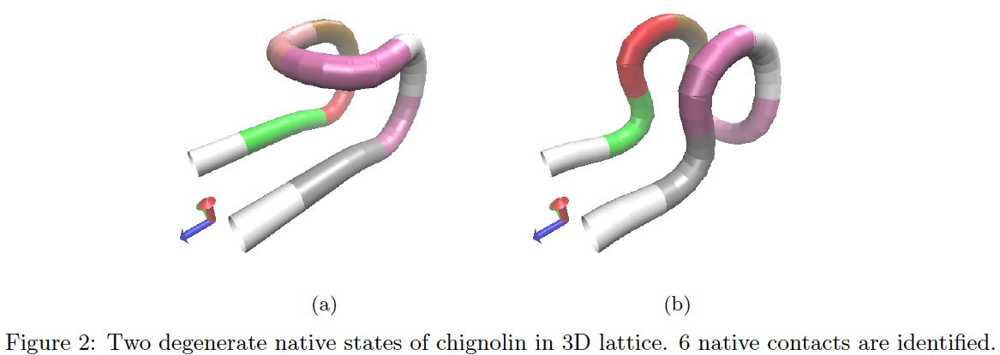
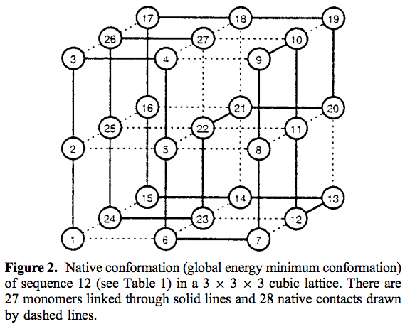
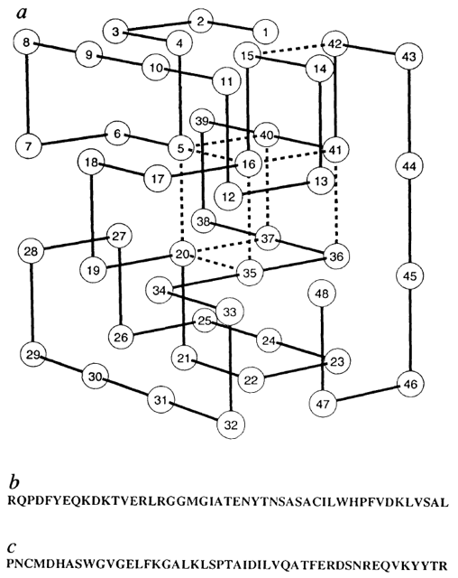

Chignolin
----------------

* [Chignolin](http://www.rcsb.org/pdb/explore.do?structureId=1UAO) is an artificial decapepetide that has the smallest known sequence to fold into $\beta$-hairpin in aqueous solution. [Ref](http://www.sciencedirect.com/science/article/pii/S0969212604002424)

--------

27-mers
----------------

* One [27-mers](https://www.nature.com/articles/379096a0) has been studied in lattice protein simualtions. Their structures and native conformation were originally published [here](https://pubs.acs.org/doi/pdf/10.1021/jp972648c).

--------

48-mers
----------------

* Two [48-mers](https://www.nature.com/articles/379096a0) are intensively studied in lattice protein simualtions. Their structures and native conformation were originally published [here](https://www.nature.com/articles/379096a0).

--------